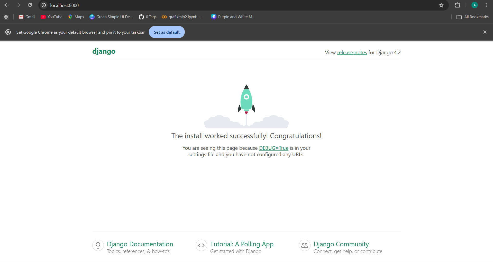
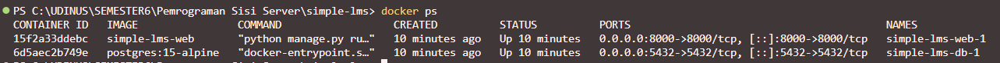
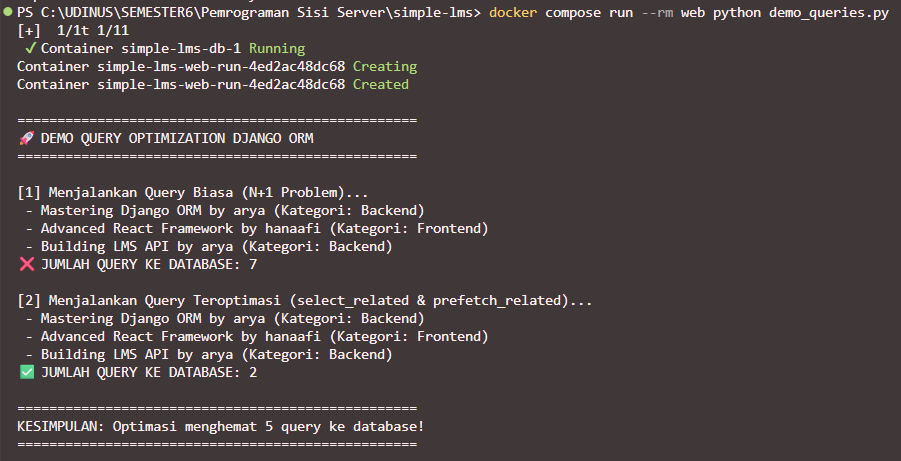
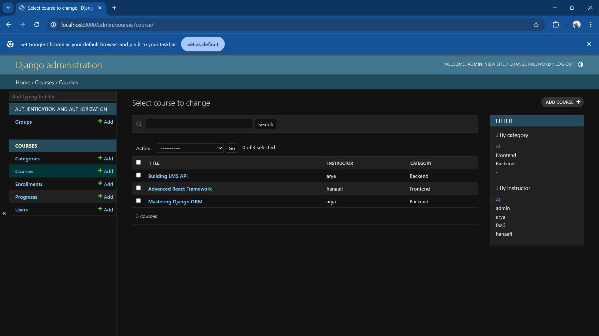

# Simple LMS - Django Dockerized

Tugas ini adalah implementasi setup environment development menggunakan Docker untuk proyek Django (Simple LMS) dengan database PostgreSQL.

## 📸 Dokumentasi

### 1. Django Welcome Page (Localhost:8000)
Halaman ini menunjukkan bahwa server Django berjalan dan dapat diakses melalui browser.


### 2. Docker Containers Running
Screenshot di bawah ini menunjukkan bahwa kedua container (`web` dan `db`) berstatus **Up/Running**.


## 🎯 Learning Objectives
- Memahami containerization dengan Docker.
- Membuat Dockerfile dan docker-compose.yml yang efisien.
- Konfigurasi Django dengan PostgreSQL di dalam Docker.

## 📦 Project Structure
Struktur proyek sesuai dengan instruksi tugas:
```text
simple-lms/
├── docker-compose.yml
├── Dockerfile
├── .env.example
├── requirements.txt
├── manage.py
├── config/
│   ├── settings.py
│   ├── urls.py
│   └── wsgi.py
└── README.

🛠️ Cara Menjalankan Project
1. Persiapan: Pastikan Docker Desktop sudah berjalan di latar belakang.
2. Build Container: Jalankan perintah berikut untuk membangun image:
    docker compose up -d --build
3. Migrasi Database: Lakukan migrasi agar tabel PostgreSQL terbuat:
    docker compose run --rm web python manage.py migrate
4. Akses Aplikasi: Buka browser di http://localhost:8000

```
## 🚀 Data Models, Django Admin & Query Optimization
*Melanjutkan pengembangan LMS dengan mendesain schema database, relasi tabel, dan optimasi ORM.*

### 🎯 Learning Objectives & Deliverables
- ✅ **Data Models:** Membuat schema database untuk `User` (dengan role), `Category` (self-referencing), `Course`, `Lesson`, `Enrollment`, dan `Progress`.
- ✅ **Query Optimization:** Mengatasi *N+1 Problem* menggunakan `select_related` dan `prefetch_related` melalui Custom Model Managers.
- ✅ **Django Admin:** Konfigurasi *list display*, *search*, *filter*, dan *Inline Models* (Lesson di dalam Course).
- ✅ **Data Fixtures:** Menyediakan file `initial_data.json` untuk kemudahan pengisian database awal.

### 📊 Demo Optimasi Query (N+1 Problem)
Untuk melihat perbandingan jumlah hit/query ke database (sebelum dan sesudah optimasi), jalankan perintah ini di terminal:
```bash
docker compose run --rm web python demo_queries.py
```
## 📸 Dokumentasi

**1. Bukti Penghematan Query (Terminal):**



**2. Konfigurasi Django Admin Panel:**



## 📦 Cara Load Initial Data (Fixtures)
Jika menjalankan project ini di komputer baru, load data dummy awal dengan perintah:
docker compose run --rm web python manage.py loaddata initial_data.json
