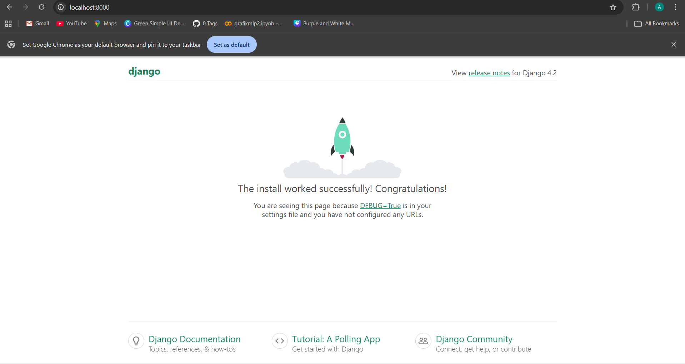
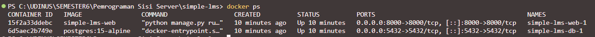
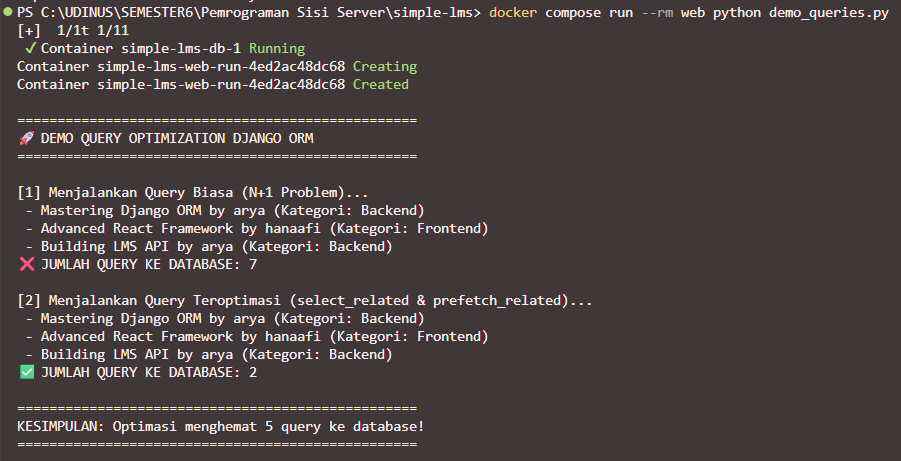
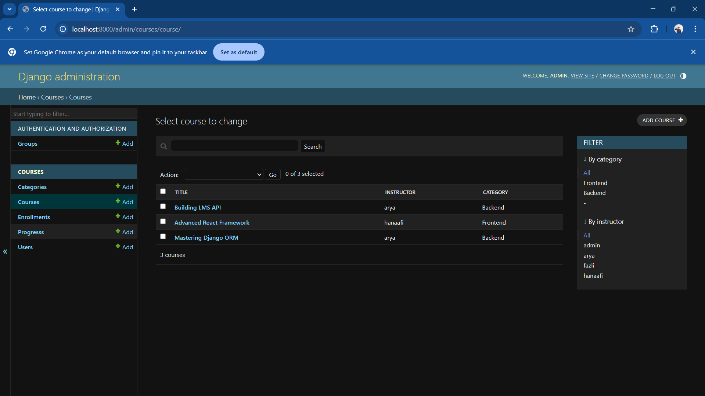
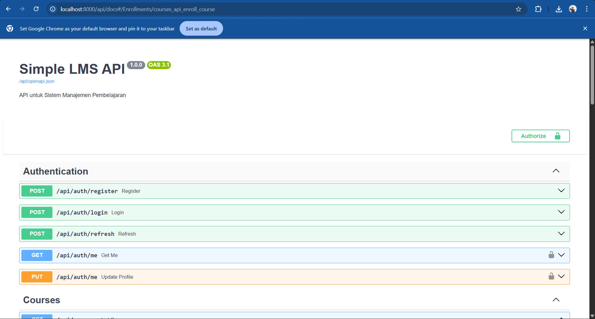

# 🎓 Simple LMS - Django Backend Ecosystem

Proyek ini adalah implementasi sistem manajemen pembelajaran (LMS) komprehensif menggunakan **Django**, **PostgreSQL**, **Docker**, dan **Django Ninja** (REST API). Proyek ini dibangun melalui 3 tahapan tugas utama.

---

## 📦 Tahap 1: Dockerized Environment
Implementasi setup *environment development* menggunakan Docker dan PostgreSQL.

**Pencapaian:**
- ✅ *Containerization* menggunakan Docker Compose (`web` dan `db`).
- ✅ Konfigurasi Django dengan database PostgreSQL.
- ✅ Server berjalan mulus di `http://localhost:8000`.

**Dokumentasi:**



---

## 🗄️ Tahap 2: Data Models & Query Optimization
Mendesain skema *database relasional* dan melakukan optimasi *query* menggunakan Django ORM.

**Pencapaian:**
- ✅ **Data Models:** Tabel `User` (Role), `Category`, `Course`, `Lesson`, `Enrollment`, `Progress`.
- ✅ **Query Optimization:** Mengatasi *N+1 Problem* dengan `select_related` dan `prefetch_related`.
- ✅ **Django Admin:** Konfigurasi *list display*, *search*, *filter*, dan *Inline Models*.
- ✅ **Data Fixtures:** Tersedia `initial_data.json` untuk data *dummy*.

**Dokumentasi Penghematan Query & Admin Panel:**



---

## 🚀 Tahap 3: REST API & Role-Based Access (Capstone Project)
Membangun RESTful API yang aman dan tervalidasi menggunakan **Django Ninja**, sesuai dengan spesifikasi tugas.

### 🎯 Fitur & Deliverables
- ✅ **Kelengkapan API Endpoints (30%):** Mendukung proses Register, Login, CRUD Courses, Enrollments, dan Progress tracking.
- ✅ **JWT Authentication (20%):** Keamanan *endpoint* menggunakan JSON Web Token (Access & Refresh token) dan validasi *middleware*.
- ✅ **RBAC Implementation (15%):** Proteksi akses data menggunakan *role decorators* (`@is_admin`, `@is_instructor`, `@is_student`) dan validasi kepemilikan data (Ownership Validation).
- ✅ **Schema Validation (15%):** Menggunakan **Pydantic** untuk memvalidasi skema *request* dan *response* data.

### 📸 API Documentation (Swagger) - 10%
Dokumentasi otomatis menggunakan Swagger UI yang terintegrasi langsung di dalam sistem. Anda dapat mengaksesnya di `/api/docs`.


### 📮 Testing dengan Postman - 10%
File *Postman Collection* untuk *testing API* sudah disertakan di dalam *repository* ini dengan nama: `LMS_API_Postman_Collection.json`.
1. Buka aplikasi Postman.
2. Klik tombol **Import**.
3. Pilih file JSON tersebut dari *root* direktori proyek ini untuk langsung melakukan testing.

---

## 🛠️ Panduan Menjalankan Proyek (Local Development)

1. **Build dan jalankan container:**
   ```bash
   docker compose up -d --build

2. **Migrasi database:**
    ```bash
    docker compose run --rm web python manage.py migrate

3. **Load data awal (Fixtures):**
    ```bash
    docker compose run --rm web python manage.py loaddata initial_data.json
4. **Jalankan Demo Optimasi Query (N+1 Problem):**
    ```bash
    docker compose run --rm web python demo_queries.py
5. **Akses Layanan Aplikasi:**

    📖 Swagger API Docs: http://localhost:8000/api/docs
    
    ⚙️ Django Admin: http://localhost:8000/admin